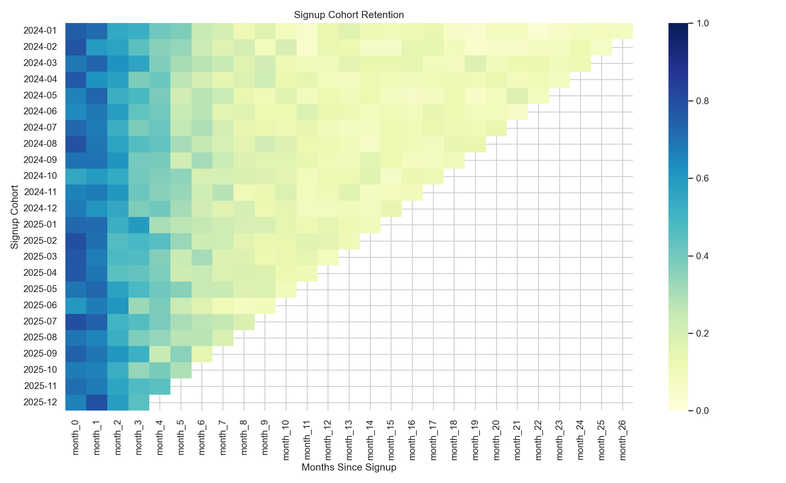

# User Behavior & Retention Analysis

This project analyzes product activity data to understand user engagement, cohort retention, churn risk, and activation drop-off. It is written as a junior data analyst/product analyst portfolio case study: clear business questions, SQL/Python analysis, dashboard-ready outputs, and specific recommendations.

## Business Problem

Product teams need to know where users lose momentum after signup and which actions can improve retention. This project answers:

- How many users are active daily and monthly?
- How sticky is the product based on DAU/MAU?
- How well do signup cohorts retain over time?
- Where do users drop off before the first key action?
- Which retention actions should be prioritized?

## Dashboard Preview



## Tools Used

- SQL for DAU, MAU, retention, churn, and funnel queries
- Python and Pandas for cohort analysis and metric exports
- Matplotlib and Seaborn for visual checks and portfolio charts
- Power BI-ready CSV outputs for dashboard building

## Key Findings

- Latest DAU: 61 users
- Latest MAU: 369 users
- DAU/MAU stickiness: 16.5%
- Average Month 1 retention: 68.4%
- Average Month 3 retention: 44.5%
- Latest monthly churn rate: 18.5%
- First key action conversion: 50.6%
- Largest early lifecycle risk: 49.4% of users drop before first key action

## Business Recommendations

1. Shorten onboarding and guide users faster to the first key action.
2. Trigger lifecycle messages for users who sign up but do not complete onboarding within 24 hours.
3. Build channel-specific onboarding for lower-converting acquisition sources, especially Social.
4. Study Referral users because they show the strongest first-key-action conversion.
5. Track Month 1 retention as the early north-star retention metric.

## Project Outputs

- `data/processed/daily_active_users.csv`
- `data/processed/monthly_active_users.csv`
- `data/processed/cohort_retention.csv`
- `data/processed/cohort_retention_matrix.csv`
- `data/processed/dropoff_funnel.csv`
- `data/processed/churn_summary.csv`
- `docs/insights.md`
- `docs/dashboard_spec.md`
- `reports/figures/cohort_retention_heatmap.png`
- `reports/figures/activation_funnel.png`
- `reports/figures/daily_active_users.png`
- `reports/figures/monthly_active_users.png`

## How To Run

```bash
python scripts/generate_sample_data.py
python scripts/retention_analysis.py
```

